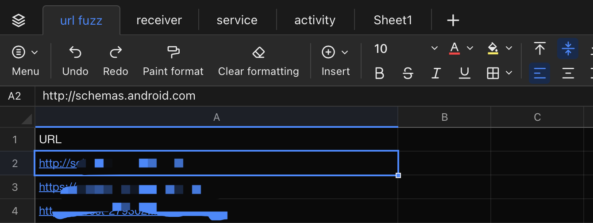
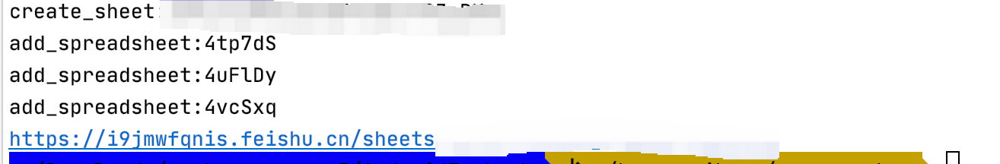

# AndroidForLark

Android Auto Analyse, Up Data To LarkExecl

[https://blog.csdn.net/xiru9972/article/details/126532196](https://blog.csdn.net/xiru9972/article/details/126532196)

# 20220825 更新

增加URL fuzz

# usage

python3 component_analyse.py --project_dir xxx

or

python3 component_analyse.py --apk_dir xxx

